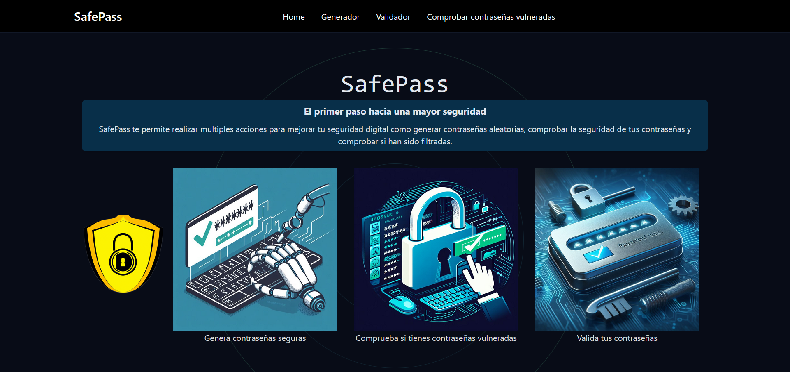
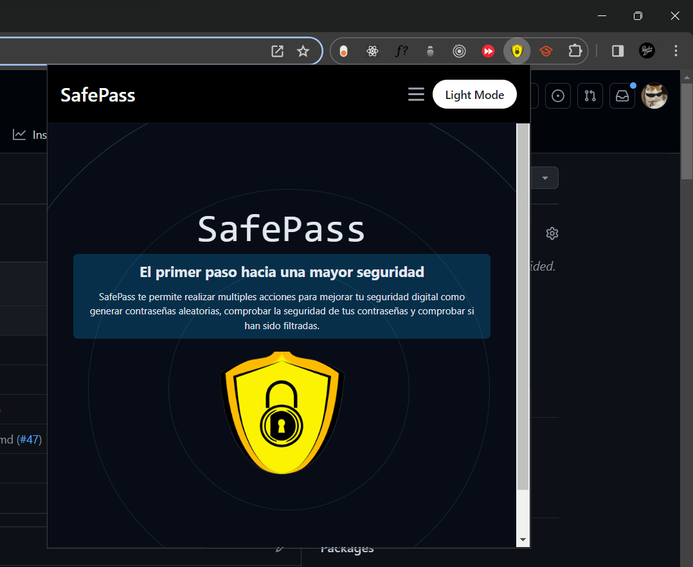

<!-- Crea un índice con las dos opciones de títulos Principales -->

# SafePass
SafePass te permite realizar multiples acciones para mejorar tu seguridad digital como generar contraseñas aleatorias, comprobar la seguridad de tus contraseñas y comprobar si han sido filtradas.

# Tabla de Contenidos
- [SafePass](#safepass)
  - [Miembros del equipo](#miembros-del-equipo)
  - [Instalación](#instalación)
    - [Frontend](#frontend)
    - [Backend](#backend)
  - [Funcionalidades](#funcionalidades)
  - [Tecnologías utilizadas](#tecnologías-utilizadas)
- [Instrucciones para importar la extensión en el navegador](#instrucciones-para-importar-la-extensión-en-el-navegador)
  - [Vista Previa de extensión](#vista-previa-de-extensión)
  - [Construyendo la extensión](#construyendo-la-extensión)
  - [Cargando la extensión localmente](#cargando-la-extensión-localmente)

## Miembros del equipo

- Tarek Kheir
- Hugo Leal
- Adrián López
- César Martín
- Luigi Martínez
- Alejandro Martínez L.
- Pablo López

## Instalación
Para comenzar con SafePass, siga estos pasos
1. Clona el repositorio en tu máquina local usando `git clone https://github.com/A13xMtzL/SafePassApplication.git`

### Frontend

1. Navegue al directorio del proyecto usando `cd safepass\safe_pass_front`
2. Instale las dependencias usando `npm install`
3. Inicie el servidor de desarrollo usando `npm run dev`
4. Abra su navegador web y navegue hasta `http://localhost:5173`

### Backend

1. Navegue al directorio del proyecto usando `cd safepass\safe_pass_back\src`
2. Inicie el servidor de backend usando `python app.py`
(Notese que es necesario tener instalado python 3 o superior)

>[!TIP]
> **Alternativamente, puedes ejecutar el proyecto usando el archivo `start.bat`:**

1. Haga doble clic en el archivo `start.bat` para iniciar el servidor de desarrollo y el backend.
2. Abra su navegador web y navegue hasta `http://localhost:5173`

## Funcionalidades

- Generar contraseñas aleatorias
- Comprobar si una contraseña ha sido filtrada
- Hacer una comprobación de que tan seguro es tu contraseña

## Tecnologías utilizadas

- ReactJS
- TailwindCSS
- Python
- Flask

# Instrucciones para importar la extensión en el navegador
## Vista Previa de extensión
<!--  -->

## Construyendo la extensión

Para crear la extensión, sigue estos pasos:

1. Instale las dependencias del proyecto ejecutando `npm install` en el directorio raíz del proyecto.
2. Cree la versión de producción del proyecto ejecutando `npm run build` en la carpeta `"safe_pass_front"`. Esto creará un directorio `dist` con los archivos de extensión integrados.

## Cargando la extensión localmente

Para cargar la extensión en su navegador Chrome localmente, realiza estos pasos:

1. Abre Chrome y navegue hasta `chrome://extensions`.
2. Habilite el modo Desarrollador haciendo clic en el interruptor de palanca en la esquina superior derecha.
3. Haga clic en "Cargar descomprimido" y seleccione el directorio `dist` creado cuando creó el proyecto.

La extensión SafePass ahora debería estar cargada en su navegador y lista para usar.
